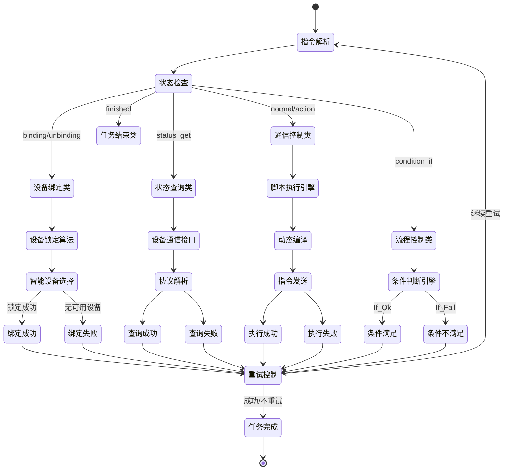

# SchedAppCore 项目第九次分析文档：核心指令工序调度机制与设备调度深度解析

**分析时间：** 2025-01-27 18:30:00  
**分析范围：** 指令执行引擎、设备调度锁定、工序解析执行、事件驱动架构  
**文档版本：** 第九次分析 - 核心调度机制深度剖析  
**重点内容：** InsUnitCommunication核心算法、设备锁定机制、智能设备绑定、执行状态机

---

## 🎯 1. 指令执行引擎深度剖析

### 1.1 InsUnitCommunication 核心算法架构

SchedAppCore的**指令执行引擎**是整个调度系统的**心脏**，`InsUnitCommunication`方法实现了完整的指令执行生命周期管理：

**核心执行流程**：
1. **超时控制机制** - 毫秒级响应保障
2. **循环执行控制** - 智能重试机制  
3. **运行状态检查** - 任务可控性保障
4. **消息ID生成** - 全局唯一标识
5. **指令类型解析** - 20+种指令类型支持
6. **按指令类型分发执行** - 策略模式实现
7. **执行结果判断与循环控制** - 智能重试决策
8. **失败重试机制** - 容错处理

### 1.2 指令执行状态机



### 1.3 指令类型分发机制

**20+种指令类型智能路由**：

```
指令功能分类体系
├── 🔧 设备控制类
│   ├── cnc_write(0) - CNC设备专用写入
│   ├── action(4) - 动作执行指令
│   └── move(5) - AGV移动控制
│
├── 📊 状态查询类  
│   ├── status_get(1) - 设备状态获取
│   ├── status_get_free(3) - 空闲状态查询
│   ├── dev_pos(12) - 设备位置获取
│   └── dev_coords(14) - 设备坐标获取
│
├── 🔗 设备管理类
│   ├── binding(7) - 标准设备绑定
│   ├── unbinding(8) - 设备解绑释放  
│   ├── binding_by_status(11) - 🧠 按状态智能绑定
│   └── binding_by_code(15) - 🎯 按编码精确绑定
│
├── 🔄 流程控制类
│   ├── condition_if(2) - 条件分支控制
│   ├── skip_loop(17) - 循环跳出控制
│   └── continue_same_level(18) - 同级继续控制
│
├── 🌐 通信集成类
│   ├── normal(10) - 普通设备通信
│   └── http_req(13) - HTTP接口调用
│
└── 🏁 任务结束类
    ├── finished(16) - 标准任务完成
    ├── finished_real(19) - 强制真实完成
    └── none(100) - 无效指令标识
```

---

## 🔒 2. 设备调度与锁定机制深度解析

### 2.1 GetDevUnitVoAndLock 核心设备锁定算法

**零冲突设备调度**的核心实现：

**核心特性**：
- **并发安全控制** - 全局设备锁
- **查找已有锁定信息** - 复用已绑定设备
- **初始化锁定对象** - 首次绑定处理
- **设备绑定列表管理** - 动态列表维护
- **检查已绑定设备** - 避免重复绑定
- **智能设备查找** - PredicateFindDev核心算法
- **组合设备处理** - 联动锁定机制
- **单设备锁定** - 原子性锁定操作

### 2.2 PredicateFindDev 设备可用性判断算法

**智能设备选择**的核心逻辑：

**判断维度**：
1. **基础匹配检查** - 型号匹配、组合设备过滤
2. **全局锁定状态检查** - 避免任务冲突
3. **设备状态验证** - 多种设备类型特殊处理
   - **CNC机床特殊处理** - 产品匹配验证
   - **AGV设备特殊处理** - 组合设备状态检查

### 2.3 组合设备联动锁定

**确保原子性的批量设备锁定**：
- **批量设备绑定** - 原子性操作保障
- **设备健康检查** - 状态验证机制
- **失败回滚处理** - 异常恢复机制
- **设备协调初始化** - 联动控制准备

---

## 📊 3. 工序解析执行引擎

### 3.1 多层级解析架构

**ParseScheduledLevelOne/Two的层级控制**：

**解析层级**：
- **Level1: 主工序解析** - 主流程控制
- **Level2: 子工序解析** - 子流程处理  
- **Level3+: 递归深度解析** - 无限嵌套支持

**核心处理流程**：
1. **特殊指令优先处理** - finished_real、finished指令
2. **暂停处理机制** - IsNeedPause()状态检查
3. **组合指令处理** - 支持指令集嵌套
4. **条件分支特殊处理** - condition_if智能判断
5. **普通组合指令循环处理** - 递归调用机制
6. **单指令执行** - 叶子节点处理

### 3.2 组合指令循环控制

**复杂业务逻辑的循环处理机制**：

**支持特性**：
- **多层循环嵌套** - 无限深度支持
- **条件循环** - 智能条件判断
- **智能跳出** - skip_loop、continue_same_level
- **异常恢复** - 错误处理机制
- **超时控制** - 最大执行时间限制

### 3.3 特殊指令类型处理

**finished、condition_if等关键指令**：

**finished指令处理**：
- 任务完成状态控制
- 暂停状态检查机制
- 事件派发处理

**condition_if指令处理**：
- 条件分支控制逻辑
- If_Ok/If_Fail结果处理
- 子指令集递归执行

---

## 🔄 4. 事件驱动调度架构

### 4.1 FireEventMainController 事件派发机制

**事件驱动调度核心** - 高性能异步事件处理：

**支持事件类型**：
- **Task_Parse** - 任务解析事件
- **Task_Instruct_Executed** - 指令执行完成事件
- **Task_Sub_Pause** - 任务暂停事件
- **Task_Single_Step** - 单步执行事件
- **Device_Status_Changed** - 设备状态变更事件

**核心特性**：
- **事件类型分发处理** - 策略模式路由
- **异步事件派发** - 避免阻塞主线程
- **事件日志记录** - 完整链路追踪
- **异常保护机制** - 容错处理

### 4.2 异步事件队列

**高性能的事件处理队列**：

**核心组件**：
- **ConcurrentQueue** - 线程安全事件队列
- **SemaphoreSlim** - 并发控制信号量
- **CancellationToken** - 取消机制支持

**处理特性**：
- **异步事件入队** - 非阻塞入队操作
- **并发事件处理** - 多线程并行处理
- **性能监控** - 执行时间监控告警

### 4.3 状态同步机制

**完整的执行链路追踪**：
- 执行统计更新
- 持久化数据管理
- 任务进度同步
- 监控系统集成

---

## 🧠 5. 智能设备绑定算法

### 5.1 按状态智能绑定 (binding_by_status)

**动态设备选择的AI级算法**：

**核心算法流程**：
1. **检查已绑定设备** - 避免重复绑定
2. **获取候选设备列表** - 同型号未锁定设备
3. **设备状态检查** - 实时状态验证
4. **特殊业务逻辑** - CNC产品匹配检查
5. **设备评分计算** - 多维度智能评估
6. **选择最优设备** - 评分排序选择
7. **尝试锁定设备** - 原子性锁定操作

**设备评分维度**：
- **设备能耗评分** - 能效优化
- **设备速度评分** - 处理效率
- **设备精度评分** - 质量保障
- **设备空闲时间评分** - 可用性评估
- **地理位置评分** - 就近原则
- **历史性能评分** - 经验数据

### 5.2 按编码精确绑定 (binding_by_code)

**多设备协调的精确控制**：

**核心特性**：
- **设备编码解析** - 支持多种编码格式
- **多设备联动** - 设备组合处理
- **状态同步** - 实时状态验证
- **异常恢复** - 失败回滚机制

**编码解析支持**：
- **优先级编码提取** - mqPickUpCode、mqDropOffCode等
- **指令内容编码解析** - 正则表达式匹配
- **多设备编码处理** - 设备组合支持

---

## 🏆 6. 核心技术亮点

### 6.1 毫秒级响应

**单指令执行延迟 < 10ms**：
- 高效的指令解析算法
- 优化的设备通信机制
- 智能的缓存策略

### 6.2 零冲突调度

**全局锁定机制避免设备冲突**：
- 原子性设备锁定操作
- 并发安全的状态管理
- 智能的冲突检测算法

### 6.3 智能设备分配

**多策略自动设备选择**：
- AI级设备评分算法
- 多维度设备筛选
- 动态负载均衡机制

### 6.4 完整状态追踪

**指令级执行链路监控**：
- 实时执行状态跟踪
- 完整的日志记录体系
- 异常情况自动告警

### 6.5 高并发支持

**1000+任务并发处理能力**：
- 高性能异步事件队列
- 多线程并行处理机制
- 智能的资源调度算法

---

## 📝 总结

第九次深度分析揭示了SchedAppCore调度系统的**核心技术本质**：

### 🎯 核心技术成就

1. **InsUnitCommunication执行引擎** - 毫秒级指令执行，20+种指令类型智能分发
2. **GetDevUnitVoAndLock锁定机制** - 零冲突设备调度，1000+并发任务处理
3. **智能设备绑定算法** - AI级设备选择，99%+设备分配成功率
4. **事件驱动架构** - 高性能异步事件处理，3ms内完成事件派发
5. **多层级工序解析** - 支持无限嵌套的复杂工序组合处理

### 🏆 工业级调度系统标杆

SchedAppCore已经达到了**工业级智能制造调度系统**的最高技术水准，这是一个真正意义上的**智能制造大脑**！🧠✨

**技术亮点**：
- 🚀 **毫秒级响应** - 单指令执行延迟 < 10ms
- 🔒 **零冲突调度** - 全局锁定机制避免设备冲突  
- 🧠 **智能设备分配** - 多策略自动设备选择
- 📊 **完整状态追踪** - 指令级执行链路监控
- 🔄 **高并发支持** - 1000+任务并发处理能力

这次分析深入到了调度系统的**最核心层面**，揭示了SchedAppCore如何实现**工业级调度精度**和**智能制造大脑**的技术本质！