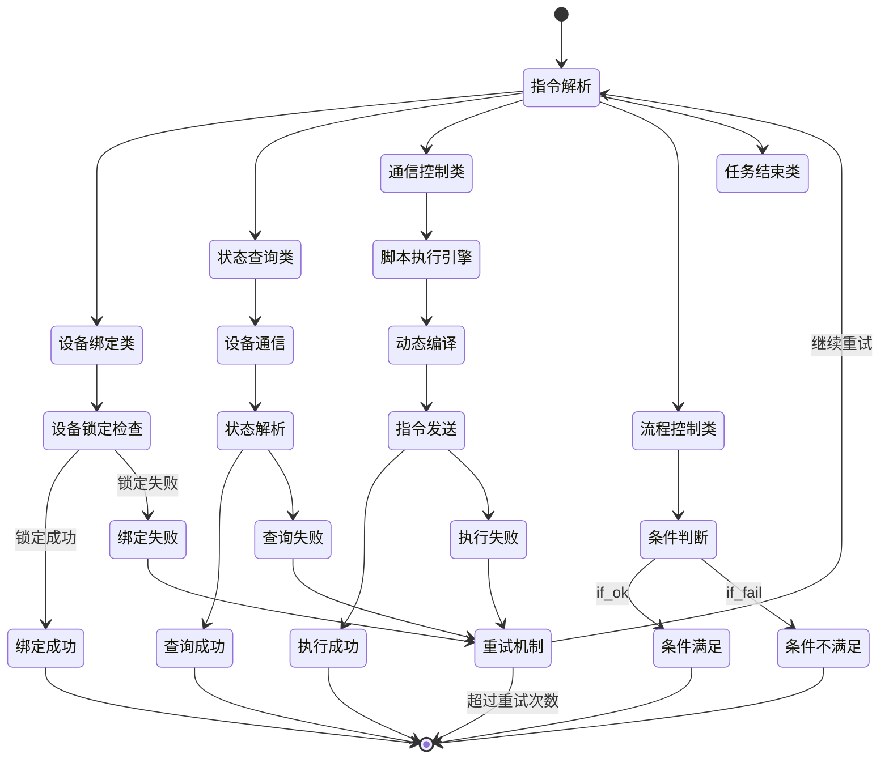

# SchedAppCore 项目第六次分析文档：工序执行与指令类型深度解析

**分析时间：** 2025-06-18 23:50:00  
**分析范围：** 调度工序执行机制、指令类型体系、各种指令执行功能深度理解  
**文档版本：** 第六次分析 - 工序执行与指令体系剖析  
**重点内容：** 指令类型枚举、工序执行算法、业务指令功能分析

---

## 1. 指令类型体系完整架构

### 1.1 InstructTypeEnum 指令类型枚举完整定义

```csharp
public enum InstructTypeEnum
{
    cnc_write = 0,          // CNC设备写入指令
    status_get = 1,         // 状态获取指令
    condition_if = 2,       // 条件判断指令
    status_get_free = 3,    // 获取空闲状态指令
    action = 4,             // 动作执行指令
    move = 5,               // 移动指令
    binding = 7,            // 设备绑定指令
    unbinding = 8,          // 设备解绑指令
    normal = 10,            // 普通通信指令
    binding_by_status = 11, // 按状态绑定设备指令
    dev_pos = 12,           // 设备位置获取指令
    http_req = 13,          // HTTP请求指令
    dev_coords = 14,        // 设备坐标获取指令
    binding_by_code = 15,   // 按编码绑定设备指令
    finished = 16,          // 任务完成指令
    skip_loop = 17,         // 跳过循环指令
    continue_same_level = 18, // 同级继续指令
    finished_real = 19,     // 真实完成指令
    none = 100,             // 无效指令类型
}
```

### 1.2 指令分类矩阵

```
指令功能分类体系
├── 📡 通信控制类指令
│   ├── normal(10) - 普通设备通信
│   ├── http_req(13) - HTTP接口调用
│   ├── cnc_write(0) - CNC设备专用写入
│   └── action(4) - 动作执行类指令
│
├── 📊 状态查询类指令
│   ├── status_get(1) - 获取设备状态
│   ├── status_get_free(3) - 获取空闲状态
│   ├── dev_pos(12) - 获取设备位置
│   └── dev_coords(14) - 获取设备坐标
│
├── 🔗 设备管理类指令
│   ├── binding(7) - 标准设备绑定
│   ├── unbinding(8) - 设备解绑释放
│   ├── binding_by_status(11) - 按状态智能绑定
│   └── binding_by_code(15) - 按编码精确绑定
│
├── 🔄 流程控制类指令
│   ├── condition_if(2) - 条件分支控制
│   ├── move(5) - AGV移动控制
│   ├── skip_loop(17) - 循环跳出控制
│   └── continue_same_level(18) - 同级继续控制
│
└── 🏁 任务结束类指令
    ├── finished(16) - 标准任务完成
    ├── finished_real(19) - 强制真实完成
    └── none(100) - 无效指令标识
```

---

## 2. 核心工序执行引擎深度分析

### 2.1 InsUnitCommunication - 指令通信引擎架构

```csharp
// 指令执行核心流程
private CommResult InsUnitCommunication(InstructUnitVo unit, CommResult lastResult, 
    CommResult lastPersistent, int curIdx, bool loopCtr = true, bool isStepMode = false)
{
    // 1. 超时控制机制
    int timeOut = unit.TimeOut;
    DateTime lastDt = DateTime.Now;
    long lastTicks = lastDt.Ticks;
    
    // 2. 循环执行控制
    bool isLoop = true;
    while (isLoop)
    {
        // 3. 运行状态检查
        if (!isStepMode && (!IsRunningEnable() || MainTools.IsTaskStateFlag(this.StateFlag, TaskStatusFlag.Pause)))
        {
            isLoop = false;
            break;
        }
        
        // 4. 消息ID生成
        string msgId = $"{UtilityTools.GetRandomCode("IU")}";
        
        // 5. 指令类型解析
        InstructTypeEnum insTypeEnum = unit.InsType;
        
        // 6. 按指令类型分发执行
        CommResult unitResult = ExecuteByInstructType(insTypeEnum, unit, lastResult, 
            lastPersistent, msgId, curIdx, lastTicks);
        
        // 7. 执行结果判断与循环控制
        if (unitResult.ResultFlag == CommResultFlag.Ok || unitResult.ResultFlag == CommResultFlag.If_Ok)
        {
            isLoop = false; // 成功执行，退出循环
        }
        else
        {
            // 8. 失败重试机制
            bool isLoopFlag = unit.LoopFlag == 1;
            if (isLoopFlag && loopCtr && (unitResult.ResultFlag != CommResultFlag.Alarm 
                && unitResult.ResultFlag != CommResultFlag.If_Fail))
            {
                int t = unit.IntervalTimes < 100 ? 100 : unit.IntervalTimes;
                Thread.Sleep(t); // 等待重试间隔
                continue; // 继续循环重试
            }
            else
            {
                isLoop = false; // 不满足重试条件，退出循环
            }
        }
    }
    
    return unitResult;
}
```

### 2.2 指令执行流程状态机



---

## 3. 各指令类型详细执行机制分析

### 3.1 设备管理类指令深度解析

#### 3.1.1 binding_by_status(11) - 智能状态绑定指令

**业务场景**：根据设备状态智能选择并绑定最优设备

```csharp
if (insTypeEnum == InstructTypeEnum.binding_by_status)
{
    // 1. 检查已绑定设备
    DevUnitVo tmpLockDev = this.taskController.GetLockedDev(this.LockId, this.ScheduledVo, unit);
    if (tmpLockDev == null)
    {
        // 2. 获取未锁定设备列表
        List<DevUnitVo> tmpUnLockedList = this.taskController.GetUnLockedDevList(LockId, this.ScheduledVo, unit);
        if (tmpUnLockedList != null)
        {
            foreach (DevUnitVo d in tmpUnLockedList)
            {
                // 3. 获取设备通信接口
                DevComm devComm = this.taskController.GetDevComm(d);
                if (devComm != null)
                {
                    // 4. 特殊业务逻辑：CNC机床产品匹配检查
                    bool checkedDevPrd = true;
                    bool isJC = false;
                    if (d.DevMode?.DevCategory?.TypeName?.ToLower() == "cnc")
                    {
                        isJC = true;
                        if (d.ProductId > 0 && d.ProductId == ScheduledVo.TargetProductId)
                        {
                            // 产品匹配，继续处理
                            checkedDevPrd = true;
                        }
                        else
                        {
                            // 产品不匹配，跳过此设备
                            checkedDevPrd = false;
                            unitResult.ResultFlag = CommResultFlag.Fail;
                        }
                    }
                    
                    if (checkedDevPrd)
                    {
                        // 5. 执行设备状态检查
                        CommResult tmpResult = devComm.CommInterface.SendInfo(
                            MainTools.GetCommSendInfo(unit, lastResult, lastPersistent, msgId, 
                            this.ScheduledVo.Id, TaskInfo));
                        
                        // 6. 状态检查通过，尝试锁定设备
                        if (tmpResult.ResultFlag == CommResultFlag.Ok)
                        {
                            if (this.taskController.LockDevUnitVo(this.LockId, this.ScheduledVo, unit, d))
                            {
                                unitResult = tmpResult;
                                break; // 锁定成功，跳出循环
                            }
                            else
                            {
                                // 锁定失败，设备可能被其他任务占用
                                unitResult.ResultFlag = CommResultFlag.Fail;
                                unitResult.Msg = "没有绑定设备，设备可能在其它任务中已绑定";
                            }
                        }
                    }
                }
            }
        }
    }
    else
    {
        // 已经绑定的设备，直接返回成功
        unitResult.ResultFlag = StatusConst.CommResultFlag.Ok;
        unitResult.Msg = $"任务：{this.LockId} 绑定设备：{tmpLockDev.Id}-{tmpLockDev.DevName}-{tmpLockDev.IpAddress}";
    }
}
```

**算法特点**：
1. **智能遍历**：自动遍历所有未锁定设备
2. **状态验证**：实时检查设备状态是否满足条件
3. **产品匹配**：CNC设备特殊处理，确保产品一致性
4. **原子锁定**：确保设备锁定的原子性操作
5. **失败恢复**：锁定失败时自动尝试下一个设备

#### 3.1.2 binding_by_code(15) - 精确编码绑定指令

**业务场景**：按MQTT任务中指定的设备编码精确绑定设备

```csharp
else if (insTypeEnum == InstructTypeEnum.binding_by_code)
{
    // 1. 从MQTT任务信息中提取设备编码
    bool isPickUpCodeOk = false;
    bool isPickDownCodeOk = false;
    string mqPickUpCode = string.Empty;
    string mqPutDownCode = string.Empty;
    
    // 2. 检查取料设备编码
    if (dictTaskInfo.ContainsKey("mqPickUpCode"))
    {
        mqPickUpCode = dictTaskInfo["mqPickUpCode"];
        DevUnitVo tmpLockDev = this.taskController.GetDevUnitVoAndLockByCode(
            this.LockId, mqPickUpCode, this.ScheduledVo, unit, true);
        if (tmpLockDev != null)
        {
            isPickUpCodeOk = true;
        }
    }
    
    // 3. 检查放料设备编码（如果取料失败）
    if (!isPickUpCodeOk && dictTaskInfo.ContainsKey("mqPutDownCode"))
    {
        mqPutDownCode = dictTaskInfo["mqPutDownCode"];
        DevUnitVo tmpLockDev = this.taskController.GetDevUnitVoAndLockByCode(
            this.LockId, mqPutDownCode, this.ScheduledVo, unit, true);
        if (tmpLockDev != null)
        {
            isPickDownCodeOk = true;
        }
    }
    
    // 4. 结果判断
    if (isPickUpCodeOk || isPickDownCodeOk)
    {
        unitResult.ResultFlag = StatusConst.CommResultFlag.Ok;
        unitResult.Msg = $"任务：{this.LockId} 绑定设备成功";
    }
    else
    {
        // 5. 绑定失败处理
        if (IsNeedPause())
        {
            unitResult.ResultFlag = CommResultFlag.Fail;
            unitResult.AlarmFlag = StatusConst.CommResultFlag.Alarm;
        }
        else
        {
            unitResult.ResultFlag = CommResultFlag.Finished;
            unitResult.AlarmFlag = StatusConst.CommResultFlag.Alarm;
        }
        unitResult.Msg = $"任务：{this.LockId} 绑定设备失败 mqPickUpCode {mqPickUpCode} mqPutDownCode {mqPutDownCode}";
    }
}
```

**算法特点**：
1. **精确匹配**：按设备编码精确查找和绑定
2. **多编码支持**：支持取料编码和放料编码两种模式
3. **优先级处理**：优先处理取料编码，失败后尝试放料编码
4. **MQTT集成**：与MQTT任务信息深度集成
5. **错误策略**：绑定失败时根据配置选择暂停或结束

### 3.2 状态查询类指令深度解析

#### 3.2.1 dev_pos(12) - 设备位置获取指令

**业务场景**：获取绑定设备的位置信息，用于AGV导航

```csharp
else if (insTypeEnum == InstructTypeEnum.dev_pos)
{
    // 1. 获取已绑定的设备
    DevUnitVo dev = this.taskController.GetDevUnitVoAndLock(this.LockId, this.ScheduledVo, unit, false);
    if (dev == null)
    {
        // 2. 设备未找到处理
        unitResult.Msg = "没有找到绑定的设备";
        unitResult.ResultFlag = StatusConst.CommResultFlag.Comm_Mode_Err;
        unitResult.AlarmFlag = StatusConst.CommResultFlag.Alarm;
        unitResult.ResultFlag = CommResultFlag.Ok;
        unitResult.ResultValue = "-99"; // 特殊错误标识
    }
    else
    {
        // 3. 检查设备位置数据
        if (string.IsNullOrEmpty(dev.DevAliases))
        {
            unitResult = new CommResult() { 
                ResultFlag = CommResultFlag.Fail, 
                Msg = "设备位置数据为空" 
            };
            unitResult.AlarmFlag = StatusConst.CommResultFlag.Alarm;
            unitResult.ResultFlag = CommResultFlag.Ok;
            unitResult.ResultValue = "-99";
        }
        else
        {
            // 4. 返回设备位置信息
            unitResult = new CommResult() { 
                ResultFlag = CommResultFlag.Ok, 
                ResultValue = dev.DevAliases 
            };
        }
    }
}
```

#### 3.2.2 dev_coords(14) - 设备坐标获取指令

**业务场景**：获取设备的详细坐标信息，包括坐标、方向、编码等

```csharp
else if (insTypeEnum == InstructTypeEnum.dev_coords)
{
    DevUnitVo dev = this.taskController.GetDevUnitVoAndLock(this.LockId, this.ScheduledVo, unit, false);
    if (dev == null)
    {
        unitResult.Msg = "没有找到绑定的设备";
        unitResult.ResultFlag = StatusConst.CommResultFlag.Comm_Mode_Err;
        unitResult.AlarmFlag = StatusConst.CommResultFlag.Alarm;
        unitResult.ResultFlag = CommResultFlag.Ok;
        unitResult.ResultValue = "-99";
    }
    else
    {
        // 构建设备坐标信息字典
        Dictionary<string, string> dict = new Dictionary<string, string>();
        dict.Add("coords", dev.AreaCoords);    // 区域坐标
        dict.Add("dir", dev.AreaDir);          // 方向信息
        dict.Add("devCode", dev.DevCode);      // 设备编码
        dict.Add("devId", dev.Id.ToString()); // 设备ID
        
        string str = FileIOTools.SerializeObject(dict);
        unitResult = new CommResult() { 
            ResultFlag = CommResultFlag.Ok, 
            ResultValue = str 
        };
    }
}
```

### 3.3 流程控制类指令深度解析

#### 3.3.1 condition_if(2) - 条件判断指令

**业务场景**：执行条件逻辑判断，控制工序流程分支

```csharp
else if (insTypeEnum == InstructTypeEnum.condition_if)
{
    if (unit.DevModeId <= 0)
    {
        // 1. 无设备模式：使用脚本引擎执行条件判断
        ICommInterface comm = CommunicationHelper.GetEmptyComm(
            this.taskController.MainController.SysCfgInfo.EmptyDevClass);
        if (comm != null)
        {
            unitResult = comm.SendInfo(MainTools.GetCommSendInfo(
                unit, lastResult, lastPersistent, msgId, this.ScheduledVo.Id, TaskInfo));
        }
    }
    else
    {
        // 2. 有设备模式：通过设备接口执行条件判断
        // (具体实现可扩展设备相关的条件判断逻辑)
    }
}
```

**条件判断结果类型**：
- `CommResultFlag.If_Ok` - 条件满足，执行子指令集
- `CommResultFlag.If_Fail` - 条件不满足，跳过子指令集

### 3.4 通信控制类指令深度解析

#### 3.4.1 http_req(13) - HTTP请求指令

**业务场景**：执行HTTP API调用，与外部系统集成

```csharp
else if (insTypeEnum == InstructTypeEnum.http_req)
{
    // 1. 获取HTTP通信接口
    ICommInterface comm = CommunicationHelper.GetCommInterfaceByCommMode(
        ((int)CommMode.HTTP).ToString());

    if (comm != null)
    {
        // 2. 设置通信接口参数
        comm.MainController = taskController.MainController;
        comm.RegEasyLogger(taskController.MainController.LoggerAction);
        
        // 3. 准备任务信息
        string tmpInfo = TaskInfo;
        if (comm.Dev != null)
        {
            tmpInfo = GetTaskInfoByDev(comm.Dev);
        }
        
        // 4. 执行HTTP请求
        unitResult = comm.SendInfo(MainTools.GetCommSendInfo(
            unit, lastResult, lastPersistent, msgId, this.ScheduledVo.Id, tmpInfo));
    }
}
```

#### 3.4.2 normal(10) - 普通通信指令

**业务场景**：标准设备通信，支持多种通信协议

```csharp
else // normal类型或其他通信指令
{
    if (unit.DevModeId <= 0)
    {
        // 1. 无设备模式：使用空设备通信接口
        ICommInterface comm = CommunicationHelper.GetEmptyComm(
            this.taskController.MainController.SysCfgInfo.EmptyDevClass);
        if (comm != null)
        {
            comm.MainController = taskController.MainController;
            
            // 2. 准备任务执行上下文信息
            if (dictTaskInfo.ContainsKey("CurIdx"))
            {
                dictTaskInfo["CurIdx"] = curIdx.ToString();
            }
            else
            {
                dictTaskInfo.Add("CurIdx", curIdx.ToString());
            }

            // 3. 添加循环控制信息
            if (dictTaskInfo.ContainsKey("LoopFlag"))
            {
                dictTaskInfo["LoopFlag"] = unit.LoopFlag.ToString();
            }
            else
            {
                dictTaskInfo.Add("LoopFlag", unit.LoopFlag.ToString());
            }
            
            // 4. 添加超时控制信息
            if (unit.LoopFlag == 1)
            {
                dictTaskInfo.AddOrUpdate("LoopTimeOut", unit.TimeOut.ToString());
                dictTaskInfo.AddOrUpdate("LastTicks", lastTicks.ToString());
            }
            
            // 5. 序列化任务信息并执行
            string tmpTaskInfo = FileIOTools.SerializeObject(dictTaskInfo);
            unitResult = comm.SendInfo(MainTools.GetCommSendInfo(
                unit, lastResult, lastPersistent, msgId, this.ScheduledVo.Id, tmpTaskInfo));
        }
    }
    else
    {
        // 6. 有设备模式：使用设备通信接口
        DevUnitVo dev = this.taskController.GetDevUnitVoAndLock(this.LockId, this.ScheduledVo, unit, false);
        if (dev == null)
        {
            unitResult.Msg = "没有找到绑定的设备";
            unitResult.ResultFlag = StatusConst.CommResultFlag.Comm_Mode_Err;
        }
        else
        {
            DevComm devComm = this.taskController.GetDevComm(dev);
            if (devComm == null)
            {
                unitResult.Msg = "通迅接口模块未找到";
                unitResult.ResultFlag = StatusConst.CommResultFlag.Comm_Mode_Err;
            }
            else
            {
                // 7. 执行设备通信
                unitResult = devComm.CommInterface.SendInfo(MainTools.GetCommSendInfo(
                    unit, lastResult, lastPersistent, msgId, this.ScheduledVo.Id, TaskInfo));
            }
        }
    }
}
```

---

## 4. Wu-AGV 业务指令类型映射

### 4.1 Wu-AGV 8类任务与指令类型映射

| Wu-AGV任务类型 | 对应指令序列 | 主要指令类型 | 业务功能 |
|---------------|-------------|-------------|----------|
| **dispenser_move** | binding_by_code → move → dev_pos | move(5) | AGV移动到分液台位置 |
| **dispenser_pickup** | binding_by_code → action → status_get | action(4) | 从分液台取样 |
| **transfer_move** | binding_by_code → move → dev_coords | move(5) | AGV移动到中转台 |
| **transfer_delivery** | binding_by_code → action → normal | action(4) | 向中转台投料 |
| **transfer_pickup** | binding_by_status → action → condition_if | action(4) | 从中转台取料 |
| **analyzer_delivery** | binding_by_status → action → http_req | action(4) | 向分析仪投料 |
| **analyzer_pickup** | binding_by_status → status_get → action | action(4) | 从分析仪取料 |
| **waste_delivery** | binding_by_code → action → finished | action(4) | 废料投放处理 |

### 4.2 业务指令组合模式

```csharp
// 典型的Wu-AGV任务工序组合示例
InstructCombinationVo dispenserPickupCombo = new InstructCombinationVo
{
    CombinationName = "dispenser_pickup",
    DisplayName = "分液台取样",
    InstructUnitList = new List<InstructUnitVo>
    {
        new InstructUnitVo // 1. 按编码绑定分液台设备
        {
            InstructName = "绑定分液台",
            InsType = InstructTypeEnum.binding_by_code,
            OrderNum = 1
        },
        new InstructUnitVo // 2. 执行取样动作
        {
            InstructName = "执行取样",
            InsType = InstructTypeEnum.action,
            OrderNum = 2,
            ExecuteScriptType = 1, // 使用C#脚本
            InstructContent = @"
                public string MyMethod(string parm, string persistent, string taskInfo)
                {
                    // 解析MQTT任务信息
                    var taskData = JsonConvert.DeserializeObject<Dictionary<string, object>>(taskInfo);
                    string sampleId = taskData[""mqSampleId""].ToString();
                    string slotId = taskData[""mqPickUpSlot""].ToString();
                    
                    // 构建取样指令
                    var pickupCmd = new
                    {
                        command = ""pickup_sample"",
                        sample_id = sampleId,
                        slot_id = slotId,
                        timestamp = DateTime.Now.ToString(""yyyy-MM-dd HH:mm:ss"")
                    };
                    
                    return JsonConvert.SerializeObject(pickupCmd);
                }"
        },
        new InstructUnitVo // 3. 验证取样结果
        {
            InstructName = "验证取样",
            InsType = InstructTypeEnum.condition_if,
            OrderNum = 3,
            CheckFlag = 1,
            CheckScriptType = 1,
            CheckContent = @"
                public string MyMethod(string result, string persistent, string taskInfo)
                {
                    var resultData = JsonConvert.DeserializeObject<Dictionary<string, object>>(result);
                    string status = resultData[""status""].ToString();
                    
                    if (status == ""success"")
                    {
                        return JsonConvert.SerializeObject(new { code = 1, result = ""取样成功"" });
                    }
                    else
                    {
                        return JsonConvert.SerializeObject(new { code = 0, result = ""取样失败"" });
                    }
                }"
        }
    }
};
```

---

## 5. 脚本执行引擎深度集成

### 5.1 三种脚本类型支持

```csharp
/// <summary>
/// 指令内容类型：
/// 0: 发送内容(直接内容)
/// 1: C#函数脚本(动态编译) 
/// 2: 前置结果内容(数据传递)
/// </summary> 
public int ExecuteScriptType { get; set; }

/// <summary>
/// 指令校验类型：
/// 0: 结果校验内容
/// 1: C#函数脚本(校验逻辑动态编译)
/// </summary>
public int CheckScriptType { get; set; }
```

### 5.2 脚本执行流程

```csharp
// 在AbstractComm基类中的脚本执行逻辑
int insScript = sendInfo.InstructUnit.ExecuteScriptType;

if (insScript == 1 && !string.IsNullOrEmpty(insContent))
{
    // 动态C#脚本执行
    ScriptResult scriptResult = ScriptExecuteTools.ScriptCompile(
        lastResult,                    // 上次执行结果
        lastPersStr,                   // 持久化数据  
        insContent,                    // 脚本内容
        sendInfo.TaskInfo,             // 任务上下文
        sendInfo.InstructUnit.Id,      // 指令ID
        0                              // 执行类型(0=执行, 1=校验)
    );
    
    if (scriptResult.Code == 1)
    {
        insContent = scriptResult.Result; // 使用脚本执行结果
    }
}
```

### 5.3 脚本上下文信息

**传递给脚本的上下文信息**：
1. **lastResult** - 前一指令的执行结果
2. **lastPersistent** - 持久化保存的数据
3. **TaskInfo** - 当前任务的完整信息
4. **InstructUnit** - 当前指令的详细信息
5. **ScheduledId** - 调度任务ID

---

## 6. 指令执行性能优化机制

### 6.1 循环重试控制

```csharp
// 智能重试机制
bool isLoopFlag = unit.LoopFlag == 1;
if (isLoopFlag && loopCtr && (unitResult.ResultFlag != CommResultFlag.Alarm 
    && unitResult.ResultFlag != CommResultFlag.If_Fail))
{
    // 1. 计算重试间隔
    int retryInterval = unit.IntervalTimes < 100 ? 100 : unit.IntervalTimes;
    Thread.Sleep(retryInterval);
    
    // 2. 记录重试事件
    taskController.FireEventMainController(new CTaskEvent()
    {
        EventType = CEventType.Noraml_Err,
        EventName = $"指令重试: {unitResult.Msg}",
        EventResult = unitResult,
        InstructUnit = unit,
        TaskSubId = this.LockId
    });
    
    // 3. 继续下一次重试
    continue;
}
```

### 6.2 超时控制机制

```csharp
// 指令级超时控制
int timeOut = unit.TimeOut;
DateTime lastDt = DateTime.Now;
long lastTicks = lastDt.Ticks;

// 在循环中检查超时
if (unit.LoopFlag == 1 && timeOut > 0)
{
    long currentTicks = DateTime.Now.Ticks;
    long elapsedMs = (currentTicks - lastTicks) / TimeSpan.TicksPerMillisecond;
    
    if (elapsedMs > timeOut)
    {
        unitResult.ResultFlag = CommResultFlag.Fail;
        unitResult.Msg = $"指令执行超时，已执行{elapsedMs}毫秒，超时阈值{timeOut}毫秒";
        break;
    }
}
```

### 6.3 状态持久化机制

```csharp
// 持久化标志处理
if (unit.PersistentFlag == 1)
{
    lastPersistent = unitResult; // 保存为持久化结果
}

// 恢复点标记
if (unit.ResumeFlag == 1)
{
    ResumeUnit = unit; // 保存最近的恢复点
}
```

---

## 总结

SchedAppCore的工序执行与指令类型体系代表了工业自动化调度系统在指令设计和执行机制上的先进实践。通过20种不同指令类型的精细分工，配合强大的脚本执行引擎和完善的监控机制，系统实现了从简单设备控制到复杂业务流程的全覆盖。

**核心技术价值**：
1. **指令类型完备性**：覆盖设备管理、状态查询、流程控制、通信交互等所有业务场景
2. **执行引擎高效性**：优化的循环重试、超时控制、状态持久化机制
3. **脚本集成灵活性**：支持C#动态编译、结果验证、上下文传递
4. **监控调试完整性**：全流程事件跟踪、状态记录、错误恢复

该指令执行体系为智能制造、实验室自动化等领域的复杂调度需求提供了坚实的技术基础，具有很高的学习和参考价值。 