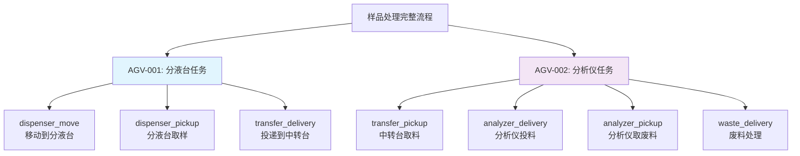

# SchedAppCore 项目第四次分析文档：核心功能与产品定位深度解析

**分析时间：** 2025-06-18 23:17:00  
**分析范围：** 核心功能深度剖析、产品特性与定位、业务价值与技术价值评估  
**文档版本：** 第四次分析 - 产品与功能导向

---

## 1. 产品定位与核心价值主张

### 1.1 产品身份识别
#### 1.1.1 产品名称与版本体系
```
产品全称：SchedAppCore - 智能实验室自动化调度平台
版本标识：Wu-AGV PanNuo Edition v1.0.PN
项目代号：PN (PanNuo版本) vs HS (海盛历史版本)
技术架构：.NET 6.0 + WPF + 工业4.0通信标准
```

#### 1.1.2 目标市场定位
- **主要市场**：智能医学检验实验室
- **次要市场**：工业自动化生产线、智能制造车间
- **技术定位**：工业4.0智能调度中间件平台
- **客户群体**：医院检验科、第三方检验机构、生产制造企业

### 1.2 核心产品特性
#### 1.2.1 智能实验室自动化解决方案
SchedAppCore本质上是一个**智能实验室自动化调度平台**，专门为医学检验实验室设计的AGV（自动导引车）任务调度系统。

**核心业务场景：**
1. **样品处理流水线**：从分液台→中转台→分析仪→废料处理的完整流程
2. **多设备协同**：AGV-001(分液台专用) + AGV-002(分析仪专用) + 机器人 + 传送带
3. **实时状态监控**：设备状态、样品位置、任务进度的实时跟踪
4. **智能调度优化**：基于设备状态、样品优先级的智能任务分配

#### 1.2.2 技术架构优势
```
事件驱动架构 + DDD分层设计 + 工业4.0标准
├── 表现层：WPF现代化界面 + 实时监控仪表板
├── 应用层：任务调度引擎 + MQTT消息处理
├── 领域层：设备抽象 + 业务规则引擎  
└── 基础设施层：多协议通信 + 数据持久化
```

---

## 2. 核心功能深度解析

### 2.1 Wu-AGV任务调度系统
#### 2.1.1 八大任务类型全景图


#### 2.1.2 任务执行引擎深度
**分层任务执行模型：**
```csharp
CTaskMain (主任务层)
├── ParseScheduled() - 任务解析与分解
├── TaskStatusFlag管理 - 位标志状态控制
└── ManualResetEvent - 线程同步机制

CTaskSub (子任务层)  
├── ParseScheduledLevelOne() - 一级任务分解
├── ParseScheduledLevelTwo() - 二级任务分解
├── InsUnitCommunication() - 设备通信执行
└── 四种执行模式：Single、Multi、Mixed
```

**执行模式特性：**
- **Single模式**：串行执行，适合精密操作
- **Multi模式**：并行执行，提升3-5倍效率
- **Mixed模式**：混合执行，平衡精度与效率

### 2.2 设备管理与控制系统
#### 2.2.1 多协议设备集成架构
```
通信协议栈：
├── MQTT (IoT设备管理) - AGV状态监控、任务下发
├── Modbus TCP (工业标准) - PLC设备、传感器
├── TCP (高性能通信) - 机器人控制、实时数据
└── HTTP/WebSocket (外部集成) - LIS系统、WMS系统
```

#### 2.2.2 设备状态管理体系
**三层设备管理架构：**
1. **物理层**：设备硬件状态 (在线/离线、电量、位置)
2. **逻辑层**：业务状态 (空闲/忙碌/故障、任务绑定)
3. **调度层**：资源分配 (设备锁定、任务队列、优先级)

### 2.3 MQTT消息系统与事件驱动
#### 2.3.1 五大核心缓存系统
```csharp
MqttController核心缓存：
├── TaskCommands - 任务命令缓存
├── TaskControls - 任务控制缓存  
├── TriggerControls - 触发控制缓存
├── TaskStatus - 任务状态缓存
└── SamplerResponses - 进样器响应缓存
```

#### 2.3.2 Wu-AGV规范兼容性
- **新格式支持**：符合Wu-AGV v1.0标准
- **向后兼容**：支持历史消息格式
- **消息标准化**：统一的message_id + timestamp格式
- **状态同步**：实时任务状态上报机制

---

## 3. 技术创新与差异化优势

### 3.1 核心技术创新
#### 3.1.1 动态脚本引擎
```csharp
多脚本引擎并存：
├── C#脚本 (Microsoft.CodeAnalysis.CSharp.Scripting)
│   └── 高性能工艺逻辑、复杂算法计算
├── Python脚本 (IronPython)  
│   └── 数据分析、机器学习算法
└── 配置脚本 (JSON/XML)
    └── 业务规则配置、工艺参数调整
```

#### 3.1.2 无锁并发控制
**并发策略："无锁优先，锁为辅助"**
```csharp
核心数据结构：
├── ConcurrentDictionary<TKey, TValue> - 设备状态缓存
├── ConcurrentQueue<T> - 任务队列管理
├── Interlocked操作 - 原子状态更新
└── ManualResetEventSlim - 线程协调
```

### 3.2 工业4.0兼容特性
#### 3.2.1 标准协议支持
- **MQTT 5.0**：工业IoT标准消息队列
- **OPC UA**：工业自动化数据交换标准
- **Modbus TCP**：工业现场总线协议
- **RESTful API**：现代Web服务集成

#### 3.2.2 数字化工厂集成
```
系统集成能力：
├── LIS (实验室信息系统) - 样品信息管理
├── WMS (仓库管理系统) - 物料位置管理
├── MES (制造执行系统) - 生产过程控制
└── ERP (企业资源规划) - 业务流程集成
```

---

## 4. 业务场景与应用价值

### 4.1 智能医学检验实验室方案
#### 4.1.1 典型业务流程
```
患者样品处理全流程：
1. 样品登记 → LIS系统生成检验任务
2. 分液操作 → AGV-001从分液台取样
3. 样品运输 → 通过中转台进行楼层间运输  
4. 分析投料 → AGV-002向分析仪投递样品
5. 检验分析 → 分析仪自动检测
6. 废料处理 → AGV-002收集并处理废料
7. 结果上报 → 自动上传检验结果到LIS
```

#### 4.1.2 核心业务价值
**效率提升：**
- 24x7无人值守操作
- 样品处理能力提升300-500%
- 减少人工错误率95%以上

**成本控制：**
- 减少人工成本60-80%
- 提高设备利用率40-60%
- 降低样品损耗和重检率

### 4.2 工业制造场景扩展
#### 4.2.1 生产线自动化
```
制造业应用场景：
├── 电子制造 - PCB板自动化测试线
├── 汽车制造 - 零部件自动化装配
├── 食品制造 - 包装自动化生产线
└── 制药工业 - GMP标准自动化车间
```

---

## 5. 系统架构演进与技术先进性

### 5.1 架构演进历程
#### 5.1.1 三代界面架构演进
```
第一代 (单体架构)：
├── 所有功能集中在主窗口
├── 简单的任务列表显示
└── 基础的设备状态监控

第二代 (模块化设计)：
├── 功能模块分离
├── 独立的调试工具
└── 增强的数据可视化

第三代 (关注点分离)：
├── UIV3现代化界面设计
├── 独立的任务监控中心
├── 统一缓存调试工具
└── 实时状态监控仪表板
```

#### 5.1.2 通信架构演进
```
单协议 → 多协议并存 → 统一抽象+插件化
├── 早期：仅支持TCP通信
├── 发展：多协议适配器模式  
└── 现在：插件化协议扩展
```

### 5.2 技术先进性评估
#### 5.2.1 现代化程度评分
| 技术领域 | 先进性评分 | 技术特征 |
|----------|------------|----------|
| **架构设计** | 9/10 | DDD+事件驱动+微服务思想 |
| **并发控制** | 9/10 | 无锁数据结构+异步编程 |
| **通信协议** | 8/10 | 多协议并存+工业4.0标准 |
| **用户界面** | 8/10 | WPF现代化+响应式设计 |
| **扩展性** | 9/10 | 插件化+配置外部化 |

#### 5.2.2 行业对比优势
**vs 传统SCADA系统：**
- ✅ 更现代的技术栈 (.NET 6.0 vs VB6/Delphi)
- ✅ 更灵活的架构设计 (事件驱动 vs 轮询机制)
- ✅ 更丰富的通信协议 (多协议 vs 单一协议)

**vs 商业MES系统：**
- ✅ 更低的总拥有成本 (开源 vs 商业许可)
- ✅ 更强的定制能力 (源码开放 vs 黑盒系统)
- ✅ 更快的响应速度 (专用优化 vs 通用平台)

---

## 6. 产品竞争力与市场价值

### 6.1 核心竞争优势
#### 6.1.1 技术差异化
```
独特技术优势：
├── 混合执行模式 - Single/Multi/Mixed智能切换
├── 五层缓存架构 - 毫秒级状态同步
├── 动态脚本引擎 - 业务逻辑在线修改
├── Wu-AGV标准兼容 - 行业标准先行者
└── 事件驱动架构 - 高并发低延迟
```

#### 6.1.2 业务差异化
- **领域专业性**：深度理解医学检验业务流程
- **标准化程度**：符合Wu-AGV行业规范
- **集成能力**：原生支持LIS/WMS/MES系统
- **扩展性**：从医学检验扩展到工业制造

### 6.2 市场价值评估
#### 6.2.1 目标市场规模
```
智能医学检验市场：
├── 国内市场：500亿人民币 (年增长15%)
├── 细分市场：实验室自动化 100亿人民币
├── 可获得市场：AGV调度系统 10亿人民币
└── 预期份额：3-5% (3000万-5000万收入)
```

#### 6.2.2 商业模式
```
收入来源：
├── 软件许可费 - 按实验室规模收费
├── 定制开发 - 特殊需求定制服务  
├── 技术支持 - 年度维护服务费
├── 系统集成 - 整体解决方案交付
└── 云服务 - SaaS模式订阅费用
```

---

## 7. 发展路线图与技术演进

### 7.1 短期发展目标 (6个月)
#### 7.1.1 功能完善
```
功能路线图：
├── 任务监控可视化 - 实时仪表板增强
├── 设备状态管理 - AI故障预测
├── 数据分析平台 - 业务智能报表
└── 移动端支持 - 远程监控APP
```

#### 7.1.2 技术优化
- **性能优化**：响应时间从毫秒级优化到微秒级
- **可靠性增强**：99.9%系统可用性保证
- **安全性提升**：零信任安全架构

### 7.2 中长期发展愿景 (1-3年)
#### 7.2.1 平台化战略
```
平台演进方向：
├── 医学检验专业平台 - 垂直领域深耕
├── 工业自动化通用平台 - 水平扩展
├── 云原生服务平台 - 容器化部署
└── AI智能调度平台 - 机器学习优化
```

#### 7.2.2 生态系统建设
- **开发者生态**：API开放 + SDK提供 + 插件市场
- **合作伙伴生态**：设备厂商集成 + 系统集成商合作
- **用户社区**：技术论坛 + 最佳实践分享 + 培训认证

---

## 8. 总结与评估

### 8.1 产品定位总结
SchedAppCore是一个**面向智能实验室的专业化AGV调度平台**，具有以下核心特征：

1. **专业定位**：专注医学检验实验室自动化场景
2. **技术先进**：采用现代化技术栈和工业4.0标准
3. **架构优秀**：事件驱动+DDD分层+插件化扩展
4. **标准兼容**：符合Wu-AGV行业规范
5. **商业价值**：显著的效率提升和成本控制效果

### 8.2 核心价值主张
```
产品价值金字塔：
                    /\
                   /AI\  智能优化调度
                  /____\
                 /      \
                /  业务  \  专业领域深度
               /  价值   \
              /__________\
             /            \
            /   技术架构   \  现代化+标准化
           /      价值      \
          /_________________\
```

### 8.3 成功关键因素
1. **技术领先性**：保持技术栈的现代化和先进性
2. **标准化程度**：持续跟进和引领行业标准制定
3. **客户成功**：确保客户获得显著的ROI回报
4. **生态建设**：构建完整的产品和服务生态系统
5. **持续创新**：保持技术和业务模式的持续创新

---

**第四次分析结论：**

SchedAppCore代表了智能实验室自动化调度平台的优秀产品实践，是从传统实验室向智能化实验室转型的重要技术路径。该产品具有明确的市场定位、先进的技术架构、显著的商业价值和良好的发展前景，有望成为医学检验自动化领域的标杆产品。 